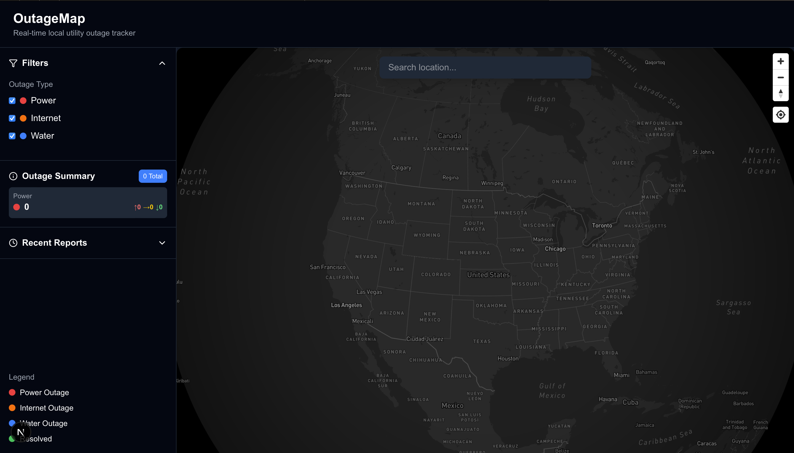

# OutageMap 🚨

 

A real-time utility outage tracking system with interactive mapping and location-based outage detection.

## Features ✨

- **Interactive Map Visualization**
  - Cluster visualization for outage density
  - Color-coded outage types (Power 🔴, Internet 🟠, Water 🔵)
  - Detailed outage popups with distance calculations
- **Smart Location Detection**
  - Automatic geolocation (with user permission)
  - Address search with autocomplete
  - Reverse geocoding for location details
- **Dynamic Filtering**
  - Filter by utility type (Power/Internet/Water)
  - Timeframe filters (Today/This Week/All)
  - Status filters (Active/Resolved)
- **Real-time Metrics**
  - Affected customers count
  - Severity level indicators
  - Resolution timelines
- **Responsive Design**
  - Mobile-friendly interface
  - Collapsible sidebar
  - Dark mode optimized

## Tech Stack 🛠️

- **Frontend**
  - React + TypeScript
  - Mapbox GL JS
  - Tailwind CSS
  - Lucide Icons
- **Utilities**
  - Haversine formula for distance calculations
  - GeoJSON data processing
  - Map clustering algorithms

## Installation 💻

1. **Prerequisites**
   - Node.js v16+
   - npm v8+
   - Mapbox API token

2. **Setup**
   ```bash
   git clone https://github.com/Dev-derah/outagewatch.git
   cd outagewatch
   npm install